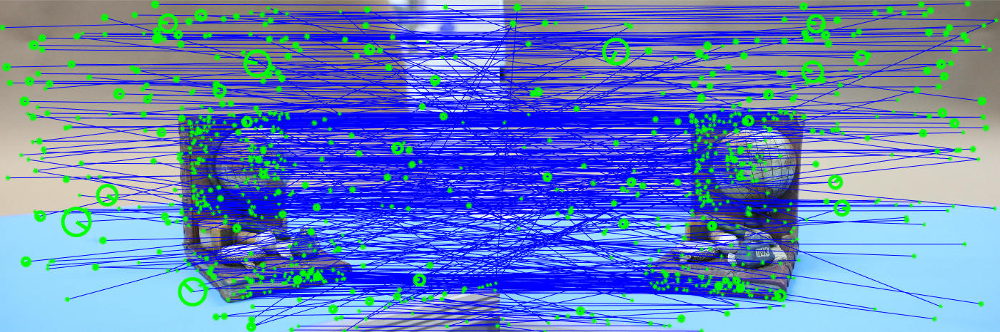

# PA2_Structure_from_motion
Programming assignment 2 of Computer vision : Structure from motion

##  1. Introduction

### Goal 

Get 3D point cloud of given scene(two images). We should use knowledge about <b>epiploar geometry</b>, Camera matrix, RANSAC, ...

### Tasks

1. Correspondence search, Relating images.
2. Initialization Step
3. Growing Step (additional assigment)

## 2. Details

### Feature extraction & matching

- Extract candidates of correspoding features in two images by using SIFT.
- Use [VLFeat](https://www.vlfeat.org/) library for applying SIFT and initial matching.

### Estimating essential matrix

- Use matched features in previous section.

- Doing outlier rejcetion by applying RANSAC.
- Randomly select 5 point and estimate E, and counting inliers about that E.
  -  Use "calibrated_fivepoint.m" for apply five-point algorithm.
  - Inliers are determined by distance between corresponding feature and epipolar line.
  - Use "Sampson distance" to get distance.
- Find the best E that corresponds to the most number of inliers.

### Essential matrix decomposition

- Use given fomula, $ E = [R|T]$
- Make 4 candidates, composition of $R'$ and $T'$.
  -  $R' = UWV^T \; or \; UW^TV^T$
  -  $T' = u_3 \; or \; -u_3$
- Counting points which have poisitive z-axis coord value.
- Find the best $R$ and $T$ corresponds to the most number of z-poistive points.

### Triangulation

- Use given fomula for triangulation.
- But, you should solve homogeneous matrix equation.
  - You should use SVD for get solution.
  - last column of $V$ ($[U,S,V] = SVD(A),\; AX=0$)

## 3. Requirement

1. MATLAB (I used MATLAB R2020b)
2. VLFeat library ([Link](https://www.vlfeat.org/))

## 4. Result

### (i) Extracted Features

These images are visualized results of task 2 and 3. Above image represents initially extracted features and correspondences of them. I extracted about 4300 features. Below image is result of RANSAC algorithm. Counted inliers are about 500 pairs. 

In above image, we can see many outliers, such as diagonal line. They don't' have correspondence, so cause severe error when we estimate essential matrix. But, below image is so clear. We can know that most of corresponding features in two images are actually matched features.

### (ii) Constructed Point Cloud

I could construct 3D point cloud about given scene. But, because I used two images, I couldn't get dence 3D pointcloud. If you want to get dense 3D pointcloud, we should use many images for SFM, and implement growing step and bundle adjustment.

